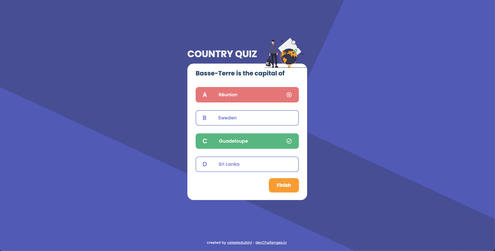

<!-- Please update value in the {}  -->

<h1 align="center">Country Quiz 🗺</h1>

<div align="center">
   Solution for a challenge from  <a href="http://devchallenges.io" target="_blank">Devchallenges.io</a>.
</div>

<div align="center">
  <h3>
    <a href="https://country-quiz-celeste.vercel.app/" target="_blank">
      Demo
    </a>
    <span> | </span>
    <a href="https://github.com/celestedubini/country-quiz-original" target="_blank">
      Solution
    </a>
    <span> | </span>
    <a href="https://devchallenges.io/challenges/Bu3G2irnaXmfwQ8sZkw8" target="_blank">
      Challenge
    </a>
  </h3>
</div>

<!-- TABLE OF CONTENTS -->

## Table of Contents

- [Overview](#overview)
  - [Built With](#built-with)
- [Features](#features)
- [How to use](#how-to-use)
- [Contact](#contact)
- [Acknowledgements](#acknowledgements)

<!-- OVERVIEW -->

## Overview


The demo is currently available at [Vercel](https://country-quiz-celeste.vercel.app/).
This project is my first approach to the [Next.js](https://nextjs.org/) framework. It's done with CSS Modules, and it's also my first personal project that was made responsive.
It was a good experience to brush up my logical skills, and I'm very happy with the current result ☺️

### Built With

<!-- This section should list any major frameworks that you built your project using. Here are a few examples.-->

- [Next.js](https://nextjs.org/)
- [Typescript](https://www.typescriptlang.org/)

## Features

<!-- List the features of your application or follow the template. Don't share the figma file here :) -->

This application/site was created as a submission to a [DevChallenges](https://devchallenges.io/challenges) challenge. The [challenge](https://devchallenges.io/challenges/Bu3G2irnaXmfwQ8sZkw8) was to build an application to complete the given user stories.

## How To Use

<!-- Example: -->

To clone and run this application, you'll need [Git](https://git-scm.com), [Node.js](https://nodejs.org/en/download/) and [Yarn](https://yarnpkg.com/) installed on your computer. From your command line:

```bash
# Clone this repository
$ git clone https://github.com/celestedubini/country-quiz-original

# Install dependencies
$ yarn

# Run the app
$ yarn dev
```

Open [http://localhost:3000](http://localhost:3000) with your browser to see the result.

## Acknowledgements

<!-- This section should list any articles or add-ons/plugins that helps you to complete the project. This is optional but it will help you in the future. For example: -->

- [Steps to replicate a design with only HTML and CSS](https://devchallenges-blogs.web.app/how-to-replicate-design/)
- [Node.js](https://nodejs.org/)

## Contact

- GitHub [@celestedubini](https://github.com/celestedubini)
- LinkedIn [María Celeste Dubini](https://www.linkedin.com/in/maria-celeste-dubini/)
- Mail <a href="mailto:celestedubini@hotmail.com" target="_blank">celestedubini@hotmail.com</a>
